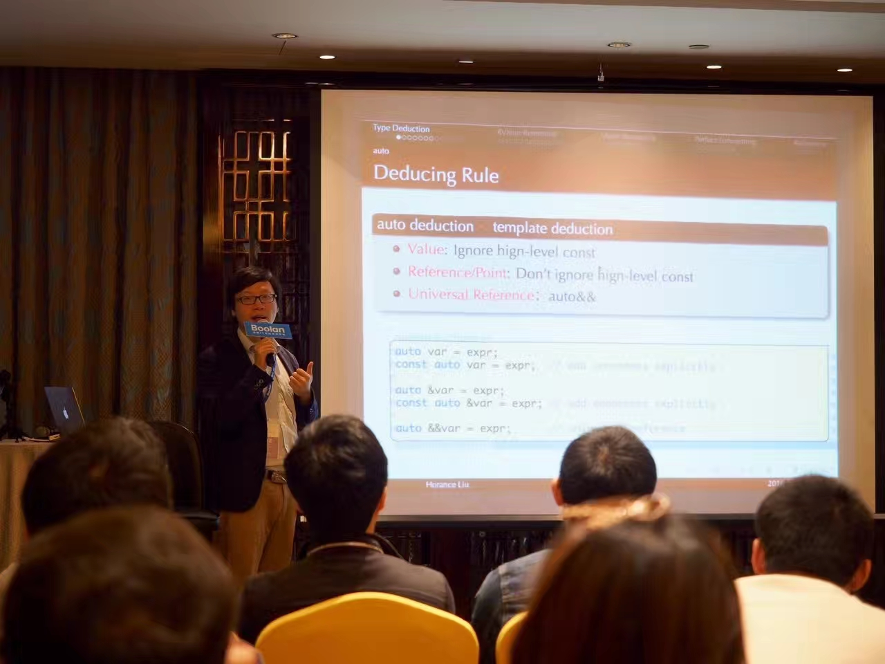
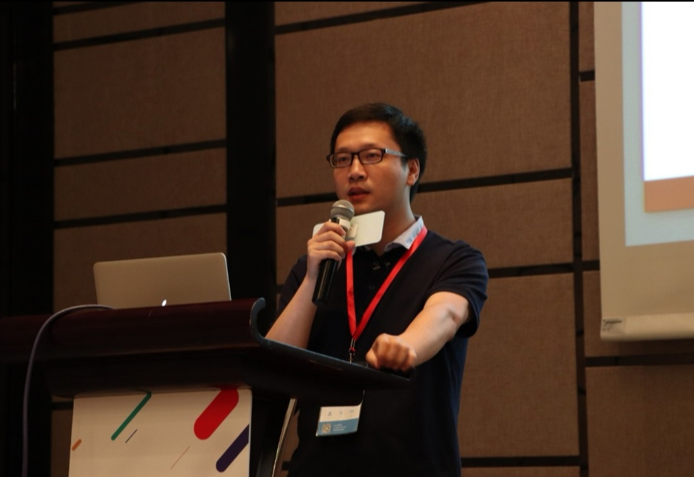
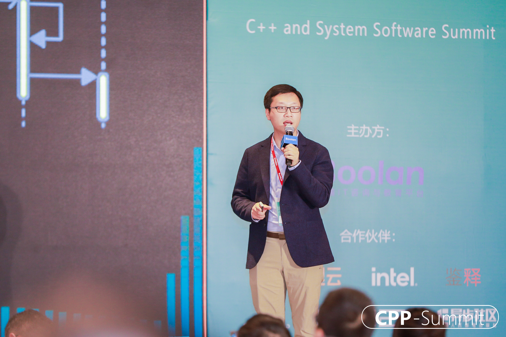

# 简历

## 个人信息

- 简介 ：刘光聪，男，1983
- 电话 ：15353694281
- 邮箱 ：liuguangcong@joycode.art
- 博客 ：https://www.jianshu.com/u/49d1f3b7049e
- 教育 ：山东大学，计算机软件与理论，学士与硕士学位；2009年毕业；

## 概况介绍

软件技术咨询师，全栈程序员，专注于大型系统软件的领域建模设计、组件化与服务化架构演进、遗留系统重构与开发者测试等领域。拥有10多年大型电信软件系统的工作和咨询经验，在大型嵌入式软件平台、无线4G/5G业务软件、机器学习计算平台等相关领域提供技术咨询服务。曾作为“2016全球C++及系统软件大会”，“2017全球机器学习大会”，“2019全球C++软件技术大会”，“2020全球C++软件技术大会”主题讲师。拥有开源著作《TensorFlow内核剖析》一部，Google认证的机器学习GDE技术专家。

## 咨询案例

#### 全球知名电信设备制造商：新一代无线RRU软件平台的架构演进咨询项目

作为技术咨询师，全力参与新一代无线RRU软件平台的架构演进过程，通过领域模型的演进式设计方法，有效解决业务深层的复杂度，并通过模型有效表达架构意图和业务逻辑，有效协同多个异地并行开发。

针对不确定的硬件变化，通过灵活的模型演进与重构的基础能力，最终达成硬件变化的有效隔离。其次，通过有效的业务建模和精细粒度的资源管理，大幅提高软件系统的性能，内存和Flash空间都得到有效的改善。

为了提高系统的组件化水平，建立了明晰的分层架构模式，使得每个组件达成独立开发、独立构建、独立测试。通过构建系统提供有效的架构约束的看护机制，最终达成物理架构与逻辑架构一致，确保架构原则的持久性。

#### 全球知名电信设备制造企业：智能化网络治理的微服务架构演进与大网改造咨询项目

作为技术咨询师，协助团队对故障管理子系统进行领域建模、大网改造、服务拆分的工作。同时，通过数据分区技术，MO模型优化，有效解决了数据同步的性能瓶颈。

其次，在客户现场挖掘研发过程浪费的深层原因，并实现了一套完备的容器化开发环境，标准化开发者的编程环境，有效支撑开发者从开发、编译、开发者测试、环境调试等自动化流水线。

通过容器化开发环境的改造，消除了重复劳动，有效提高了研发效率；其次，有效解决了团队资源紧张的问题，通过有效的共享和隔离机制，提高了资源的利用率。

#### 全球知名电信设备制造企业：无线BBU平台软件的开发者测试咨询项目

作为技术咨询师，针对BBU平台软件开发者测试不稳定和可读性差等显著问题，通过与客户深度合作，开发了用于有效表达业务过程的基础业务框架和组件测试框架，协助客户挖掘业务本质，并通过代码实现有效表达业务模型，提高了开发人员的开发和测试的设计能力。

协助客户实现高软开发者测试框架的架构和设计，实现了异步消息控制的组件测试的技术方案，并基于业务本质实现了一套用于表达业务的领域专用语言NodeLang(Node Definition Language)，有效提高了用例的稳定性和可读性。

#### 全球知名电信设备制造企业：无线BBU软件平台的重构咨询项目

作为技术咨询师，针对BBU平台软件存在的业务过程复杂，业务耦合严重的突出问题，通过领域建模和重构，挖掘业务本质模型，寻找了适合于平台软件长期演进的架构模式，有效指导软件平台架构的后期演进。

协助客户剖析业务中存在的痛点，并实现了适合于BBU业务的分层架构模式，并开发了一套用于描述高软异步控制的领域专用语言CTSL(Transaction Language in C)，有效表达业务的交互过程，提高了复杂业务过程的表达力。

## 工作经历

####  阿里巴巴-菜鸟网络
  
- 主要任职 ：系统架构师
  
- 工作内容 ：负责高性能流式计算框架的重构与优化，实现高性能、低时延的流式计算框架。重构Flink低层的运行时环境，并与Yarn无缝结合，扩展实现了高度容错的任务调度机制。引领团队Scala技术栈的转型，指导团队测试驱动 开发与软件设计，及其大型分布式系统的架构重构与性能优化。

负责分布式任务调度框架的架构与设计，设计DSL风格的计算框架的编程模型，灵活支持Spark任务、Flink任务，批式、流式等多种业务类型的应用。指导团队实践测试驱动开发，搭建基于Spock的测试框架，从零构建任务调度的测试用例集。。

#### 中兴通讯-无线研究院

- 主要任职 ：第一批无线院、公司级敏捷技术教练
  
- 工作内容 ：作为核心技术骨干，带领团队进行某无线通讯设备核心子系统的重构工作，完成50w+规模C++代码的完全重构、测试及上线，改造后的系统代码规模只有原有规模的一半。成功在复杂电信系统软件上应用了C++构建内部DSL进行业务逻辑描述，实践了领域驱动设计、DCI建模、DSL、TDD、并行构建、持续集成等优秀软件工程实践。

曾作为AI项目的首席架构师，带领团队实践AI人工智能平台的架构、设计和实现，并在无线领域完成若干智能业务和服务部署。其中，带领团队开发设计和实现AI推理框架，及其相关的模型优化的工具链，并贡献至Linux AI基金会。

## 开源作品

#### cctest：轻量级的xUnit测试框架

- 介绍：cctest是一个使用C++11语言实现的xUnit测试框架，是Google Test的替代者和革新者，cctest在阿里云，华为等大型商用C++系统中得到了有效应用。
  
- 访问：https://github.com/ccup/cctest

#### TensorFlow：深度学习框架

- 介绍：TensorFlow是一个大型分布式的深度学习框架，在深度学习领域具有巨大的影响力。刘光聪是TensorFlow核心代码的贡献者。
  
- 访问：https://github.com/tensorflow/tensorflow

#### 开源书籍《TensorFlow内核剖析》

- 介绍：《TensorFlow 内核剖析》是业界第一部诠释TensorFlow内核机理的开源专著，深刻剖析了TensorFlow架构实现和工作机理，细致地剖析了超大规模模型的分布式训练和推理的实现技术，及其在CPU与GPU异构硬件的复杂编程机制。Github获约2.3K Star，并获Google TensorFlow官方推荐阅读书籍。

- 访问：https://github.com/horance-liu/tensorflow-internals

## 社区分享

- “2016全球C++及系统软件大会”，分享主题《现代C++类型系统》；

- “2017全球机器学习大会”，分享主题《TensorFlow内核原理》；
  
- “2019全球C++软件技术大会”，分享主题《现代C++在大型嵌入式系统中的应用和实践》；

- “2020全球C++及系统级软件大会”，分享主题《面向领域模型的Modern C++实现模式》；

---

**与C++之父Bjarne Stroustrup在cpp-submit-2019上的合影**

---

**2016全球C++系统软件与技术大会主题演讲**

---

**2017全球机器学习大会主题演讲**

---

**2019全球C++软件技术大会主题演讲**

---

**2020全球C++及系统软件大会主题演讲**

